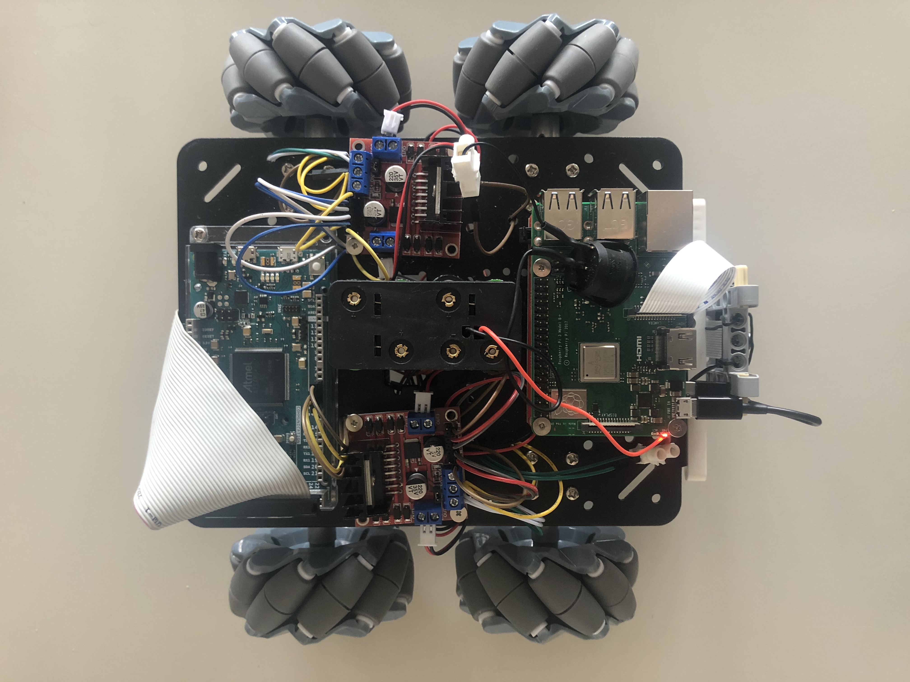
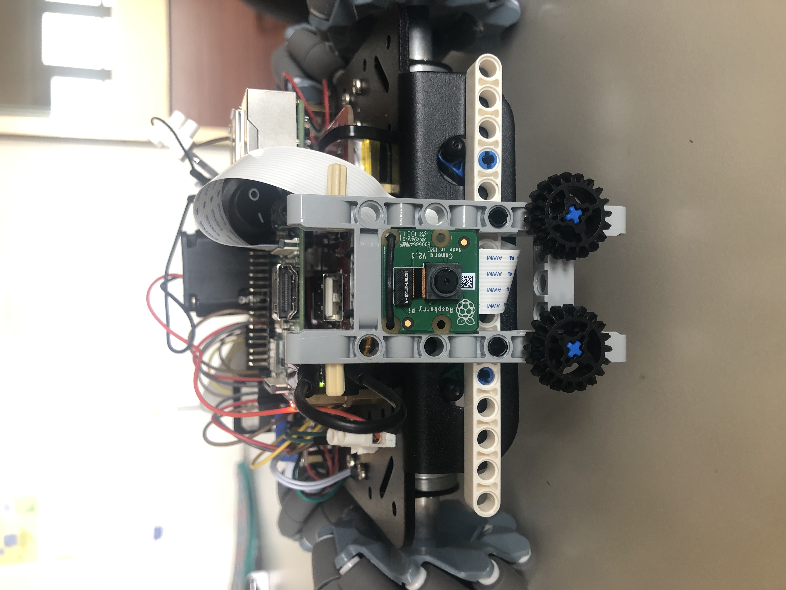

# Second Assignment - Autonomous Soccer-Robot

## GOAL OF THE ASSIGNMENT
### The goal is to build a omnidirectinal wheeled robot that should be able to detect a red ball and push it towards a goal.

## CODE ARCHITECTURE
Our code architecture can be summarized in three tasks described in the following picture:
<p align="center">
 
</p>

## THE ROBOT
<p align="center">
 
</p>
<p align="center">
 />
</p>
The robot was built using a kit that contains:
- [Arduino Due](https://www.arduino.cc/en/Guide/ArduinoDue)
- [Raspberry Pi 3 model A+](https://www.raspberrypi.org/products/raspberry-pi-3-model-a-plus/)
- [Camera Module V2](https://www.raspberrypi.org/products/camera-module-v2/)
- [Kit 4WD omni-directional wheels](https://www.amazon.it/OSOYOO-Robotico-Platform-velocit%C3%A0-Raspberry/dp/B07XRFQN8D/ref=sr_1_5?__mk_it_IT=%C3%85M%C3%85%C5%BD%C3%95%C3%91&crid=M5QEL3ZWUSSR&keywords=osoyoo+arduino+robot&qid=1581868004&sprefix=osoyoo%2Caps%2C183&sr=8-5)

Additional part:
- [RPi UPS PowerPack](https://www.amazon.it/UNIROI-Espansione-Raspberry-Ufficiale-Aggiornata/dp/B07KWTS638/ref=sr_1_2?__mk_it_IT=%C3%85M%C3%85%C5%BD%C3%95%C3%91&keywords=rasp+powerpack&qid=1581868110&sr=8-2)
- [8 x AA battery Holder](https://www.amazon.it/interruttore-Arduinos-solenoidi-coperchio-resistente/dp/B07BY3ZDDL/ref=sr_1_7?__mk_it_IT=%C3%85M%C3%85%C5%BD%C3%95%C3%91&keywords=pack+8+pile+stilo&qid=1581868190&sr=8-7) (Not suggested)
## GETTING STARTED
### Download the .zip file correspondent to the workspace in the user home folder, then unzip the package folder and access it:
```
$ cd home/experimental_ws
```

### To source the environment:
```
$ source devel/setup.bash
```

### To build the package:
```
$ catkin_make
```
### Prepare your RaspberryPi
How to start with the Raspberry Pi [Headless Raspberry Pi 3 B+ SSH WiFi Setup - Guide](https://desertbot.io/blog/headless-raspberry-pi-3-bplus-ssh-wifi-setup).

How to install ROS on the Raspberry Pi [Installing ROS Kinetic on the Raspberry Pi](http://wiki.ros.org/ROSberryPi/Installing%20ROS%20Kinetic%20on%20the%20Raspberry%20Pi).

### Link between PC and RaspberryPi:
Enter in the raspberry via ssh.

Be sure you are under the same Network of RaspPi.
```
$ ssh-keygen -R raspberrypi.local
```
```
$ ssh pi@raspberrypi.local
```

Enter the password (default psw "raspberry") and you are inside RaspPi.

Once you are inside export the ROS_IP:
```
$ export ROS_IP=<localhost of RaspPi>
```
and then start roscore:
```
$ roscore
```
Open a new terminal on your PC.
Export the ROS_IP and the MASTER_URI
```
$ export ROS_IP=<localhost of PC>
```
```
$ export ROS_MASTER_URI=http://<localhost of RaspPi>:11311
```
Do this every time you open a new terminal on your PC, to link it to RaspPI roscore.

## TASK 1: RED BALL DETECTION
In RaspberryPi (with the roscore already launched):
```
$ roslaunch raspicam_node camerav2_410x308_10fps.launch
```

From your PC launch [Ball Detection Code](https://github.com/francescacanale/experimental_ws/blob/master/src/ass_2/src/ball_detection.py):

Go to the folder in which is present the python file:
```
$ cd experimental_ws/src/ass_2/src
```
```
$ python2 ball_detection.py
```

## TASK 2: SIMULATION IN GAZEBO
To run the simulation of the robot kicking a ball in gazebo, from your PC launch [Robot Controller Code](https://github.com/francescacanale/experimental_ws/blob/master/src/ass_2/src/controller_node.cpp):
```
$ cd experimental_ws
```
```
$ roslaunch ass_2 gazebo_robot_world.launch
```
and run the simulation.

You can easly change the starting position/orientation of the robot by changing it in the [Launch file](https://github.com/francescacanale/experimental_ws/blob/master/src/ass_2/launch/gazebo_robot_world.launch).

You can also change the starting position of the ball and the goal by changing it in the [Gazebo World file](https://github.com/francescacanale/experimental_ws/blob/master/src/crestino_gazebo/worlds/crestino.world).

If the simulation does not start for some missing gazebo models, you can add the folders [Gazebo models](https://github.com/francescacanale/experimental_ws/blob/master/src/crestino_gazebo/models) in your gazebo model folder (e.g. /root/.gazebo/models).

## TASK 3: MAKE THE REAL ROBOT MOVE
With roscore active on RaspPi, open a new RaspPi terminal and go inside catkin workspace:
```
$ cd catkin_ws
```
then run the [Motor Code Raspberry Pi](https://github.com/francescacanale/experimental_ws/blob/master/src/ass_2/motor_driver/scripts/motor_driver.py):
```
$ rosrun motor_driver motor_driver.py
```
Then launch again the simulation in Gazebo.

Be sure on Arduino the [Code Arduino](https://github.com/francescacanale/experimental_ws/blob/master/src/ass_2/arduino_motors/motor_driver/motor_driver.ino) is running and be sure the serial connection between RaspPi and Arduino is working.

How to connect Arduino to Raspberry via ROS.
The inspiration code is [this](https://github.com/mktk1117/six_wheel_robot/wiki/Make-a-ROS-package-to-communicate-with-Arduino-to-control-motors).


